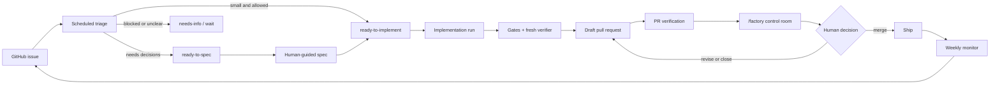

# Factory: a reference software factory

A software factory is a repeatable loop around software delivery. Instead of opening a new
agent session for every issue and steering it by hand, you define what work may be attempted,
how work starts, what evidence must be produced, and where a human must make the decision.

This repository installs that operating model into an existing GitHub project using stock
Claude Code. A thin Codex adapter uses the same policy, queue, gates, and evidence files.
There is no custom orchestrator or queue service to run.

**In practical terms:** GitHub Issues become a work queue. Scheduled agents triage the
queue, implement bounded tasks, run your real tests, obtain an independent review, and open
draft pull requests. Humans remain responsible for ambiguous requirements, system design,
load-bearing changes, and every merge.

## What this gives you

Once configured, the factory can:

- inspect new GitHub issues and route each one to implementation, specification, a named
  question, or a known blocker
- pick up small work that your charter explicitly allows, claim it without racing another
  run, implement it on a branch, and open a draft pull request
- run deterministic type, lint, test, build, audit, and architecture checks, failing closed
  when a required check is missing
- ask a fresh verifier to read the diff cold and prove that the new test fails without the
  implementation
- verify pull requests when they open, keep a visible review queue, and stop producing when
  that queue reaches your limit
- monitor the default branch and factory health, then feed findings back into GitHub as new
  issues

The value begins after code generation. This is a version-controlled method for deciding
what an agent may pick up unattended, how independent runs hand work to one another, and
what proof a human receives before making the final call.

## The mental model

There is no background factory process in this repository. The repository supplies the
rules and procedures. Claude Code cloud routines provide the default clock and compute.
GitHub carries the durable queue and pull requests. Each run starts fresh, handles one
stage, records evidence, and stops.

| Factory concept | Concrete mechanism |
|---|---|
| Intent and risk budget | A human-owned `docs/factory/CHARTER.md` |
| Work queue | GitHub Issues with `factory:*` labels |
| Handoff between stages | A structured `factory-handoff:v1` issue comment |
| Standard operating procedures | Version-controlled Claude and Codex skills |
| Clock and triggers | Claude routines, schedules, GitHub events, or the optional API-trigger Action |
| Worker | A fresh Claude Code or Codex session |
| Quality control | Your test commands, `gates.sh`, and an independent verifier |
| Control room | `/factory`, backed by live issues, PRs, and run records |
| Release authority | A human reviewing and merging the pull request |

Each loop is short and restartable. Broad goals are decomposed into queue items that one run
can claim and finish. GitHub labels and committed files survive when sessions end, making a
failed run inspectable and allowing the next run, or a different harness, to continue
without relying on conversation history.

## How an issue becomes a reviewed pull request



For example, suppose issue `#142` reports that expired tokens return `500` instead of
`401`:

1. The scheduled triage routine reads the issue, checks the charter, and decides whether it
   is small and permitted. It applies one queue label and writes a handoff containing the
   expected files, completion condition, gate level, and confidence.
2. If the issue is `factory:ready-to-implement`, a later implementation run claims the
   deterministic branch `claude/fq-142`. Only the first push wins, so two scheduled sessions
   cannot both own the issue.
3. The implementation run writes a failing test, makes the scoped change, runs the required
   gates, and delegates to a fresh verifier. It opens a draft PR only if those checks agree.
4. Opening the PR can trigger a separate verification routine. That routine reruns the gates,
   checks scope, and leaves a verdict on the PR.
5. `/factory` shows the PR in the human review queue. A person reads the evidence and decides
   whether to request changes, close it, or merge it. No routine merges.

If triage cannot infer product intent, the issue goes to `factory:ready-to-spec` and the spec
workflow pauses at four explicit human approval gates. If it needs a missing fact, the issue
is parked with the question rather than converted into speculative code.

### Where the human stays in the loop

The factory automates repeated mechanical steering while keeping engineering judgment with
a person. That person still:

- writes the charter that defines risk, scope, protected paths, and the review-queue limit
- approves product intent, observable behavior, technical design, and implementation slices
  for work that needs a spec
- reads changes to load-bearing code and any change to an existing test
- decides whether every pull request should merge
- accepts or rejects proposed changes to the factory's own constraints

Agents may classify issues, move queue labels, implement permitted work, run checks, and open
draft PRs. They may not quietly widen their scope, rewrite the charter, approve their own
work, or merge. GitHub branch protection is the final enforcement boundary.

### How work starts from GitHub

One current product limit matters to the first arrow in the diagram:
[Claude routines](https://code.claude.com/docs/en/routines) have native GitHub triggers for
pull requests and releases, but not for newly created issues.
This reference uses an hourly scheduled triage routine to poll for untriaged issues. That is
the simplest reliable default and means an issue may wait until the next run.

If you need immediate triage, install the optional GitHub Action. It reacts to the issue
event and calls the triage routine's API endpoint. Pull-request verification can use the
native `pull_request.opened` trigger. [LIMITS.md](LIMITS.md) documents the trigger boundary
and the tradeoff in detail.

## Where Claude Code and Codex fit

The factory method is shared; the unattended automation is Claude-first in this reference.

| Capability | Claude Code | Codex |
|---|---|---|
| Project policy | `CLAUDE.md` plus the shared charter and contract | `AGENTS.md` plus the same charter and contract |
| Repeatable stages | Canonical skills under `.claude/skills/` | Thin adapters under `.agents/skills/` |
| Interactive triage, spec, implementation, and status | Yes | Yes |
| Deterministic gates and GitHub queue | Shared | Shared |
| Unattended schedule supplied by this repository | Five prompts for Claude cloud routines | Not provisioned automatically |
| Native GitHub trigger used here | Pull-request verification | Not packaged by this reference |

Codex can run the same stages interactively, or you can map them to Codex goals and
automation surfaces available to you. The repository does not create those schedules or
claim that their lifecycle matches Claude routines. Whichever harness starts a run, GitHub
labels remain the queue and the shared contract remains the policy.

Codex reads [`AGENTS.md`](https://learn.chatgpt.com/docs/agent-configuration/agents-md),
discovers [repository skills](https://learn.chatgpt.com/docs/build-skills), and can load the
committed [repository hook](https://learn.chatgpt.com/docs/hooks). The adapters point back
to the canonical Claude workflows rather than maintaining a second implementation.

## Start here

This repository is an installer for another project. Clone it, run `install.sh` against the
repository you want to automate, then open that target repository in your coding agent.

- **Deciding how much machinery you need?** Read [ADVICE.md](ADVICE.md) for a pragmatic
  guide to starting with stock Claude Code or Codex, budgeting verification, and knowing
  when this Factory reference earns its additional structure.
- **Want to see the full loop first?** Explore the
  [Reel Good demo](https://github.com/addyosmani/factory-demo), then follow its
  [step-by-step workshop](https://github.com/addyosmani/factory-demo/blob/main/docs/WORKSHOP.md)
  to apply Factory to a small TMDB movie app with Claude Code Desktop or Codex.
- **Starting from a desktop app?** Follow [GETTING_STARTED.md](GETTING_STARTED.md). It has
  separate Claude Code Desktop and Codex/ChatGPT Desktop walkthroughs, including the first
  prompts to paste and the checks to run before enabling writes.
- **Ready for Claude cloud sessions and routines?** Follow
  [QUICKSTART.md](QUICKSTART.md) after the local desktop dry run is predictable.
- **Evaluating the design first?** Read [ARCHITECTURE.md](ARCHITECTURE.md) and the honest
  product constraints in [LIMITS.md](LIMITS.md).

```
factory/
├── README.md            <- you are here
├── ADVICE.md            when the harness is enough, and when Factory helps
├── GETTING_STARTED.md   desktop-first local setup
├── QUICKSTART.md        Claude cloud sessions and routines
├── ARCHITECTURE.md      why it is shaped this way
├── ROUTINES.md          the five routine prompts, copy verbatim
├── LIMITS.md            honest constraints + corrections to the common plan
├── CONTRIBUTING.md      change map and validation expectations
├── CLAUDE.md            Claude Code contributor instructions
├── AGENTS.md            Codex contributor instructions
├── install.sh
├── tests/               disposable-repo smoke tests
└── template/            shared contract plus Claude Code and Codex adapters
```

## Install

```bash
git clone https://github.com/addyosmani/factory.git
cd /path/to/your/repo
/path/to/factory/install.sh --dry-run .
/path/to/factory/install.sh .
```

Then read [GETTING_STARTED.md](GETTING_STARTED.md). The installer never overwrites an
existing file, so re-running it is safe.

---

## What gets installed

| Piece | File | Does |
|---|---|---|
| **Charter** | `docs/factory/CHARTER.md` | Human-owned tier, load-bearing paths, automatable work, definition of done, and stop conditions |
| **Contract** | `docs/factory/CONTRACT.md` | Harness-neutral queue protocol, policy, and durable-evidence rules |
| **Gates** | `.claude/scripts/gates.sh` | Types, lint, tests, build, audit, mutation, architecture. Three levels. Emits a verdict line no agent may paraphrase. |
| **Live queue** | GitHub `factory:*` labels | Visible state and handoff between independent runs |
| **Concurrency claim** | deterministic `claude/fq-<n>` branch | First non-forced push wins; later runs stop |
| **Triage** | `.claude/skills/factory-triage/` | Issues → live labels plus a reviewable queue snapshot |
| **Spec** | `.claude/skills/factory-spec/` | Four human-approved gates before any code exists |
| **Implement** | `.claude/skills/factory-implement/` | One item, test first, gates green, independently verified, draft PR |
| **Verifier** | `.claude/agents/factory-verifier.md` | Reads the diff cold. Reverts the fix to prove the test fails. Rejects when uncertain. |
| **Critic** | `.claude/agents/factory-critic.md` | Adversarial second lens on load-bearing changes |
| **Verify** | `.claude/skills/factory-verify/` | PR-level check, driven by a GitHub-triggered routine |
| **Monitor** | `.claude/skills/factory-monitor/` | Weekly sweep that closes the loop by filing issues |
| **Control room** | `/factory` | What needs you, right now, review queue first |
| **Tuning** | `/factory-tune` | Monthly constraint review, proposes only |
| **Merge guard** | `.claude/hooks/block-merge.sh` | Blocks common shell merge paths; GitHub rules remain the enforcement boundary |
| **Doctor** | `.factory/scripts/doctor.sh` | Finds placeholders, missing labels, missing remotes, and setup gaps |

---

## The four ideas doing the work

**1. Everything lives in the repo.** Cloud sessions start from a fresh clone. Committed
`.claude/` reaches them; your `~/.claude/` does not. So one set of files drives terminal,
Desktop, cloud, and routines with no config to keep in sync.

**2. Autonomy tracks consequence, not difficulty.** The charter's `TIER` sets how much
freedom every routine gets. A ten-thousand-line migration on an unlaunched project is a
safer bet than a fifty-line change to a client's auth path, and the config should say so.

**3. The gate script is the verdict.** `gates.sh` ends with a line skills must quote
verbatim. A missing required gate is `MISCONFIGURED` with exit 2, so an absent test command
cannot quietly become a green run.

**4. The writer never grades the work.** Implementation delegates to a separate verifier
that reads the diff cold and is told to ignore any account of what was done. Its best check
is one no gate can make: revert the fix and confirm the test actually fails.

## The two constraints most people delete

**Back-pressure is a number.** `STOP_IF` in the charter caps how many items may sit awaiting
review. When the queue is full, the implement routine refuses to start. The binding
constraint on a factory is not how many agents can run, it is how many decisions are pending
your judgment.

**Merge is never automated**, on any tier. Enforce this with a GitHub ruleset or branch
protection. The committed Claude and Codex hooks catch common shell routes, but hooks are a
guardrail rather than a complete security boundary.

---

## Before you build on this

Read [LIMITS.md](LIMITS.md). The headline:

- **There is no GitHub `issues` trigger.** Routine GitHub triggers cover `pull_request` and
  `release` only. The canonical *new issue → triage* arrow cannot be built with a stock
  routine. The template polls on a schedule by default and ships an optional Action that
  fires the routine's API endpoint if you need it instant.
- **Cloud environment config cannot be committed.** Network, env vars, and setup scripts are
  account-level UI state. Document yours in a `CLOUD-ENVIRONMENT.md`.
- **A green run status does not mean the task succeeded.** It means the session exited
  without an infrastructure error.
- **Environment variables are not secrets.** Leave `GH_TOKEN` unset; the GitHub proxy
  handles auth and keeps the credential out of the VM.

LIMITS.md §7 also corrects the widely circulated build plan point by point. The load-bearing
error in that plan is the issue trigger, because it is the first stage of the pipeline.

## Validate the reference

The local suite creates disposable Git repositories and exercises installation,
idempotency, fail-closed gates, deterministic claim races, merge guards, setup diagnosis,
and negative-test restoration:

```bash
bash tests/run.sh
```

## License

[MIT](LICENSE) © 2026 Addy Osmani.

## Further reading

Start with Dex Horthy's software-factory playbook,
["Harness Engineering Is Not Enough: Why Software Factories Fail"](https://youtu.be/htM02KMNZnk?t=27219).
It makes the most important constraint concrete: generation scales more easily than human
judgment, verification, and long-term comprehension.

- [Zach Lloyd's guide to cloud software factories for engineering leaders](https://www.warp.dev/blog/a-guide-to-cloud-software-factories-for-engineering-leaders)
  describes the larger organizational model and the full
  `triage → spec → implement → review → verify → ship → monitor` loop.
- Warp's practical build series starts with
  [automatic triage](https://www.warp.dev/blog/how-to-build-a-cloud-software-factory-the-automatic-triage-skill)
  and continues with
  [spec-driven development](https://www.warp.dev/blog/how-to-build-a-cloud-software-factory-add-spec-driven-development-skills).
- The official Claude Code documentation explains the extension primitives used here:
  [project instructions, skills, subagents, hooks, and plugins](https://code.claude.com/docs/en/features-overview).
- The official OpenAI documentation covers Codex
  [project instructions](https://learn.chatgpt.com/docs/agent-configuration/agents-md),
  [repository skills](https://learn.chatgpt.com/docs/build-skills), and
  [hooks](https://learn.chatgpt.com/docs/hooks).

This reference is intentionally smaller than the organization-scale designs above. In a
personal portfolio, developer variability is not the binding constraint. One person's review
attention is the entire quality apparatus, which argues for fewer moving parts, state owned
by the repository, and a hard cap on pending decisions.
